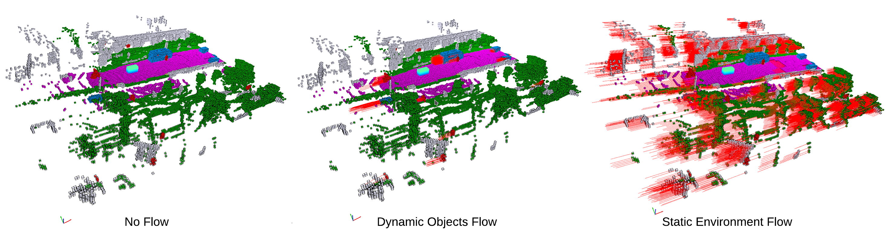

# **UniOcc**: A Unified Benchmark for Occupancy Forecasting and Prediction in Autonomous Driving

[](https://arxiv.org/abs/2503.24381)
[](https://huggingface.co/datasets/tasl-lab/uniocc)

> Autonomous Driving researchers, have you ever been bothered by the fact that popular datasets all have their different
> formats and standardizing them is a pain? Have you ever been frustrated by the difficulty to just understand
> the file semantics? This challenge is even worse in the occupancy domain. But, **UniOcc is here to help.**

**UniOcc** is a unified framework for occupancy forecasting, single-frame occupancy prediction, and occupancy flow 
estimation in autonomous driving. By integrating multiple real-world (nuScenes, Waymo) and 
synthetic (CARLA, OpenCOOD) datasets, UniOcc enables multi-domain training, seamless cross-dataset evaluation, 
and robust benchmarking across diverse driving environments.

---

## Supported Tasks

- **Occupancy Forecasting**: Predict future 3D occupancy grids over time given historical occupancies or camera inputs.
- **Occupancy Prediction**: Generate detailed 3D occupancy grids from camera inputs.
- **Flow Estimation**: Provides forward and backward voxel-level flow fields for more accurate motion modeling and object tracking.  
- **Multi-Domain Dataset Integration**: Supports major autonomous driving datasets (nuScenes, Waymo, CARLA, etc.) with consistent annotation and evaluation pipelines.  
- **Ground-Truth-Free Metrics**: Beyond standard IoU, introduces shape and dimension plausibility checks for generative or multi-modal tasks.  
- **Cooperative Autonomous Driving**: Enables multi-agent occupancy fusion and forecasting, leveraging viewpoint diversity from multiple vehicles.  

---

## Pre-requisites

We simplify our benchmark so you only need:

- Python 3.9 or higher
  ```shell
  pip install torch torchvision pillow tqdm numpy open3d
  ```
- Huggingface
  ```shell
  pip install "huggingface_hub[cli]"
  ```
  
You **do not** need:
- nuscenes-devkit
- waymo-open-dataset
- tensorflow

---

## Dataset Download

The UniOcc dataset is available on HuggingFace. The size of each dataset is as follows:

| Dataset Name                         | Number of Scenes | Training Instances | Size (GB) |
|--------------------------------------|-----------------:|-------------------:|----------:|
| NuScenes-via-Occ3D-2Hz-mini          |               10 |                404 |       0.6 |
| NuScenes-via-OpenOccupancy-2Hz-mini  |                ~ |                  ~ |       0.4 |
| NuScenes-via-SurroundOcc-2Hz-mini    |                ~ |                  ~ |       0.4 |
| NuScenes-via-OpenOccupancy-2Hz-val   |              150 |              6,019 |       6.2 |
| NuScenes-via-Occ3D-2Hz-val           |                ~ |                  ~ |       9.1 |
| NuScenes-via-SurroundOcc-2Hz-val     |                ~ |                  ~ |       6.2 |
| NuScenes-via-Occ3D-2Hz-train         |              700 |             28,130 |      41.2 |
| NuScenes-via-OpenOccupancy-2Hz-train |                ~ |                  ~ |      28.3 |   
| NuScenes-via-SurroundOcc-2Hz-train   |                ~ |                  ~ |      28.1 |
| Waymo-via-Occ3D-2Hz-mini             |               10 |                397 |      0.84 |
| Waymo-via-Occ3D-2Hz-val              |              200 |               8069 |      15.4 |   
| Waymo-via-Occ3D-2Hz-train            |              798 |             31,880 |      59.5 |
| Waymo-via-Occ3D-10Hz-mini            |               10 |              1,967 |       4.0 |
| Waymo-via-Occ3D-10Hz-val             |              200 |             39,987 |      74.4 |   
| Waymo-via-Occ3D-10Hz-train           |              798 |            158,081 |     286.6 |
| Carla-2Hz-mini                       |                2 |                840 |       1.0 |
| Carla-2Hz-val                        |                4 |              2,500 |       2.9 |   
| Carla-2Hz-train                      |               11 |              8,400 |       9.3 |
| Carla-10Hz-mini                      |                2 |              4,200 |       5.0 |
| Carla-10Hz-val                       |                4 |             12,500 |      15.0 |   
| Carla-10Hz-train                     |               11 |             42,200 |      46.5 | 
| OpenCOOD-via-OPV2V-10Hz-val          |   To Be Released |                    |           |  
| OpenCOOD-via-OPV2V-10Hz-train        |   To Be Released |                    |           |


To download each dataset, use the following command (recommend you to download only the folders you need):

```shell
huggingface-cli download tasl-lab/uniocc --include "NuScenes-via-Occ3D-2Hz-mini*" --repo-type dataset --local-dir ./datasets
huggingface-cli download tasl-lab/uniocc --include "Carla-2Hz-train*" --repo-type dataset --local-dir ./datasets
...
```

---
## Contents

Inside each dataset, you will find the following files:

```
datasets
├── NuScenes-via-Occ3D-2Hz-mini
│   ├── scene_infos.pkl
│   ├── scene_001           <-- Scene Name
│   │   ├── 1.npz           <-- Time Step
│   │   ├── 2.npz
│   │   ├── ...
│   ├── scene_002
│   ...
├── OpenCOOD-via-OpV2V-10Hz-val
│   ├── scene_infos.pkl
│   ├── scene_001           <-- Scene Name
│   │   ├── 1061            <-- CAV ID
│   │   │   │   ├── 1.npz   <-- Time Step
│   │   │   │   ├── 2.npz
│   │   │   │   ├── ...
│   │   │   ├── scene_002
│   ...
```

- `scene_infos.pkl`: A list of dictionaries, each containing the scene name, start and end frame, and other metadata.
- `scene_XXX`: A directory containing the data for a single scenario.
- `YYY.npz`: A NumPy file containing the following data for a single time step.
  - `occ_label`: A 3D occupancy grid (L x W x H) with semantic labels.
  - `occ_mask_camera`: A 3D grid (L x W x H) with binary values with `1` indicating the voxel is in the camera FOV and `0` otherwise.
  - `occ_flow_forward`: A 3D flow field (L x W x H x 3) with voxel flow vectors pointing to each voxel's next frame coordinate. In the last frame, flow is 0.
  - `occ_flow_backward`: A 3D flow field (L x W x H x 3) with voxel flow vectors pointing to each voxel's previous frame coordinate. In the first frame, flow is 0.
  - `ego_to_world_transformation`: A 4x4 transformation matrix from the ego vehicle to the world coordinate system.
  - `cameras`: A list of camera objects with intrinsic and extrinsic parameters.
    - `name`: The camera name (i.e. CAM_FRONT in nuScenes).
    - `filename`: The **relative path** to the camera image from the original datasource (i.e. nuScenes).
    - `intrinsics`: A 3x3 intrinsic matrix.
    - `extrinsics`: A 4x4 extrinsic matrix from the camera to the ego vehicle's LiDAR.
  - `annotations`: A list of objects with bounding boxes and class labels.
    - `token`: The object token, consistent with their original datasource.
    - `agent_to_ego`: A 4x4 transformation matrix from the object to the ego vehicle.
    - `agent_to_world`: A 4x4 transformation matrix from the object to the world coordinate system.
    - `size`: The size of the agent's bounding box in meters. (Length, Width, Height)
    - `category_id`: The object category (i.e. `1` for car, `4` for pedestrian, etc.)

  


> Note: we provide the flow annotation to both dynmaic voxels (agents) and static voxels (envrionments) in the scene.

---
## Visualizing the Dataset

You can visualize the dataset using the provided `viz.py` script. For example:

```shell
python viz.py --file_path datasets/NuScenes-via-Occ3D-2Hz-mini/scene-0061/0.npz
```

In this script, we also provide the API to visualize any 3D occupancy grid, with or without a flow field.

---
## Usage

### Without Camera Images

If you only need the occupancy data, you can use the provided `uniocc_dataset.py` script to load the dataset.

```python
from uniocc_dataset import UniOcc

dataset_carla_mini = UniOcc(
    data_root="datasets/Carla-2Hz-mini",
    obs_len=8,
    fut_len=12
)

dataset_nusc_mini = UniOcc(
    data_root="datasets/NuScenes-via-Occ3D-2Hz-mini",
    obs_len=8,
    fut_len=12
)

dataset = torch.utils.data.ConcatDataset([dataset_carla_mini, dataset_nusc_mini])
```

### With Camera Images

If you want to use the camera images from nuScenes, Waymo or OpV2V, it is necessary to download them from the original dataset.
- [nuScenes](https://www.nuscenes.org/download)
- [Waymo Open Dataset v1](https://waymo.com/open/download)
  - Convert to KITTI format using [this tool](https://github.com/caizhongang/waymo_kitti_converter)
- [OpV2V](https://ucla.app.box.com/v/UCLA-MobilityLab-OPV2V)

You can then provide the root directory to the dataloader to load the camera images.

```python
from uniocc_dataset import UniOcc

dataset_carla_mini = UniOcc(
    data_root="datasets/Carla-2Hz-mini",
    obs_len=8,
    fut_len=12,
    datasource_root="datasets/Carla-2Hz-mini"
)

dataset_nusc_mini = UniOcc(
    data_root="datasets/NuScenes-via-Occ3D-2Hz-mini",
    obs_len=8,
    fut_len=12,
    datasource_root="<YOUR_NUSCENES_ROOT>"  # e.g. <YOUR_NUSCENES_ROOT>/sweeps/CAM_FRONT
)

dataset_waymo_mini = UniOcc(
    data_root="datasets/Waymo-via-Occ3D-2Hz-mini",
    obs_len=8,
    fut_len=12,
    datasource_root="<YOUR_KITTI_WAYMO_ROOT>"  # e.g. <YOUR_KITTI_WAYMO_ROOT>/training/image_0
)

dataset = torch.utils.data.ConcatDataset([dataset_carla_mini, dataset_nusc_mini, dataset_waymo_mini])

```
---

## 📏 Evaluation 

Additional dependencies:
```shell
pip install shapely matplotlib scikit-learn pickle
```

Demo (needs a sample dataset in `datasets/`):
```shell
python eval.py
```

We provide these evaluation APIs, as described in our paper.


| Function | Description                                                                                                                                                         |
|-----------|---------------------------------------------------------------------------------------------------------------------------------------------------------------------|
| `FindGMMForCategory` | Fits the best Gaussian-Mixture Model (GMM) to all length-width-height triples of a chosen class, creating a “realism” prior for that object category.               |
| `ComputeObjectLikelihoods` | Segments each object in a binary occupancy grid and scores its bounding-box dimensions against the pretrained GMM, returning plausibility probabilities and counts. |
| `ComputeTemporalShapeConsistency` | Tracks every object across frames using voxel flows, aligns shapes, and reports the mean IoU of consecutive shapes, higher = smoother temporal geometry.            |
| `ComputeStaticConsistency` | Warps static voxels from frame *t* to *t + 1* via ego motion and measures how well they overlap, giving an IoU-style score for background stability.                |
| `ComputeIoU` | Computes the standard intersection-over-union between two mono-label occupancy grids while ignoring a specified “free-space” label.                                 |
| `ComputeIoUForCategory` | Same as `ComputeIoU`, but restricted to voxels of a single semantic class, enabling per-category performance evaluation.                                            |

## Checklist

- [x] Release non-cooperative datasets
- [ ] Release cooperative dataset
- [x] Release the dataset API
- [x] Release the visualization script
- [x] Release the evaluation scripts
- [ ] Release data generation scripts


---
## Citation

If you find this work useful, please consider citing our paper:

```bibtex
@article{wang2025unioccunifiedbenchmarkoccupancy,
  title={UniOcc: A Unified Benchmark for Occupancy Forecasting and Prediction in Autonomous Driving},
  author={Yuping Wang and Xiangyu Huang and Xiaokang Sun and Mingxuan Yan and Shuo Xing and Zhengzhong Tu and Jiachen Li},
  journal={arXiv preprint arXiv:2406.09246},
  year={2025},
  url={https://arxiv.org/abs/2503.24381}, 
}
```
